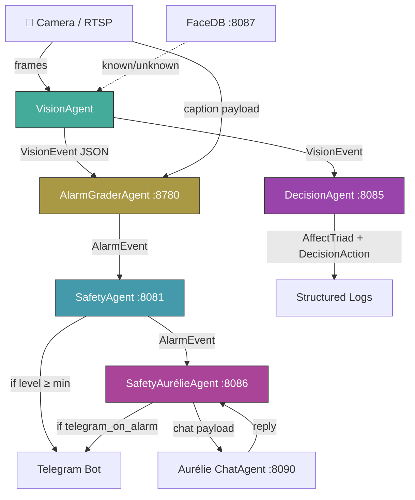
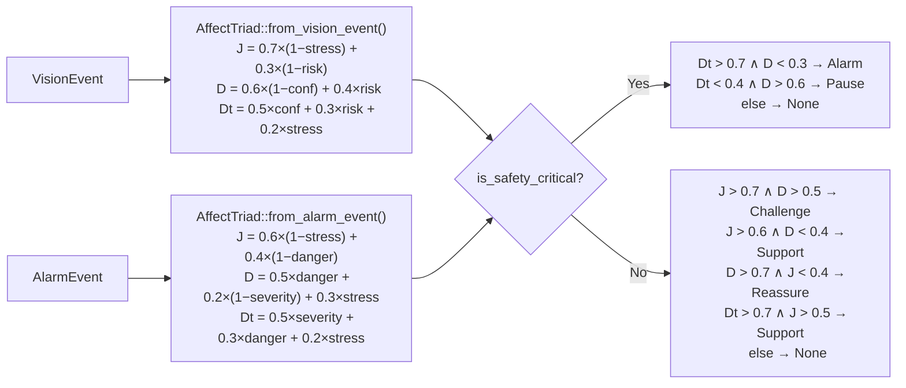
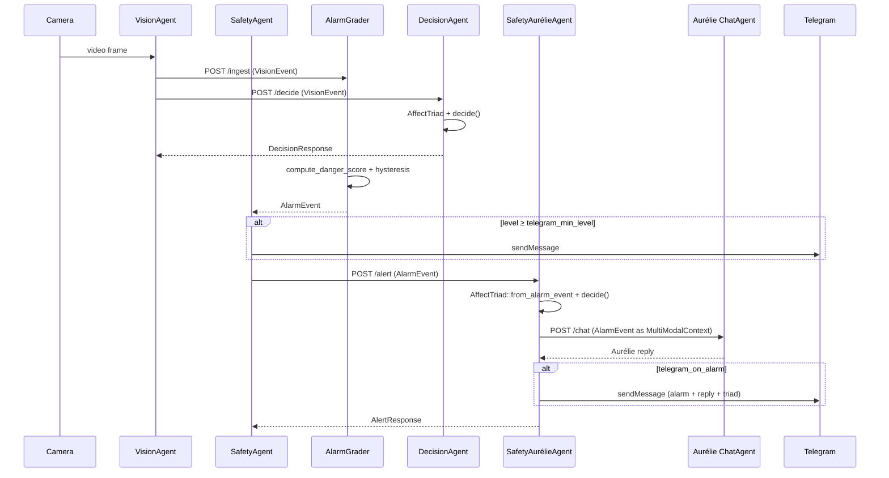

# House Security AI — Architecture

## System Overview



## Agent Inventory

| Agent               | Binary                    | Default Port | Config Key / Env Override              |
|---------------------|---------------------------|-------------|----------------------------------------|
| VisionAgent         | `vision_agent`            | —           | `vision.target_url` (outbound)         |
| SafetyAgent         | `safetyagent`             | 8081        | `app.bind_safetyagent`                 |
| AlarmGraderAgent    | `alarm_grader_agent`      | 8780        | `app.bind_alarm_grader`                |
| FaceDB              | `face_db`                 | 8087        | `app.bind_face_db`                     |
| DecisionAgent       | `decision_agent`          | 8085        | `decision.bind` / `DECISION_AGENT_BIND`|
| SafetyAurélieAgent  | `safety_aurelie_agent`    | 8086        | `aurelie_bridge.bind` / `SAFETY_AURELIE_BIND` |

## Configuration

All agents read the config file from `HOUSE_SECURITY_CONFIG`.
Recommended profiles:
- Local: `config/security.local.toml`
- Docker: `config/security.docker.toml`
- Customer node: `config/security.customer.toml`

New config sections (backward-compatible, defaults apply if absent):

```toml
[decision]
bind = "0.0.0.0:8085"
safety_risk_threshold = 0.5     # VisionEvent.risk_score above this → safety-critical

[aurelie_bridge]
bind = "0.0.0.0:8086"
aurelie_chat_url = "http://127.0.0.1:8090/chat"
request_timeout_secs = 30
telegram_on_alarm = true        # Also push alarm+reply to Telegram
```

## AffectTriad Decision Flow



## Sequence: VisionEvent → AlarmEvent → Aurélie



## Error Handling

| Agent              | Failure Mode               | Behaviour                                |
|--------------------|---------------------------|------------------------------------------|
| DecisionAgent      | Bad JSON                  | 400 + structured error body              |
| SafetyAurélieAgent | Aurélie unreachable       | 1 retry after 500ms, then fallback text  |
| SafetyAurélieAgent | Telegram send fails       | Logged, non-blocking (fire-and-forget)   |
| All agents         | Primary config unreadable | Tries `.bak` backup before failing loud  |
| Both new agents    | SIGTERM / Ctrl+C          | Graceful shutdown, in-flight reqs finish |

## Integration with Aurélie

The `SafetyAurélieAgent` bridges security events into the relational AI:

1. Receives `AlarmEvent` from SafetyAgent
2. Derives `AffectTriad` from alarm stress/danger/severity
3. Calls `decide()` in safety-critical mode
4. Constructs an `AurelieMultiModalContext` and forwards to Aurélie's `/chat`
5. On success: returns Aurélie's empathetic text + sends Telegram
6. On failure (after retry): returns a localised fallback message

This enables the security system to produce **empathetic notifications** —
not just raw alarm data, but contextual, emotionally-aware messages.
