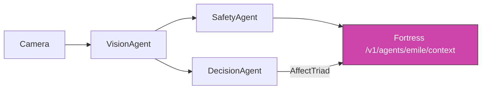

# Emile Integration — House Security AI

How the home security camera AI feeds into **Emile's soul context** in the
nuclear-platform Fortress.

---

## Data Flow



## VisionEvent → Emile Soul Envelope

The `VisionEvent` maps directly to Emile's soul envelope emotion field:

```json
{
  "agent": "emile",
  "source": "house-security-ai",
  "envelope": {
    "emotion": {
      "stress_level": 0.72,
      "behavior": "loitering",
      "risk_score": 0.78,
      "confidence": 0.81,
      "person_detected": true,
      "person_name": "unknown",
      "extra_tags": ["repeat_pass", "attention_house"]
    }
  }
}
```

## AffectTriad → Decision Gate

Before Emile responds to any context update, the AffectTriad acts as a
**decision gate**:

| Triad State                    | Gate Decision          | Emile Behavior             |
|-------------------------------|------------------------|----------------------------|
| High J + Low D + High Dt      | Pass → respond         | Confident, decisive speech |
| High J + High D + Low Dt      | Pause → reflect        | Asks clarifying questions   |
| Low J + High D + Low Dt       | Block → defer          | Acknowledges uncertainty    |
| Any + safety_critical + Alarm | Escalate → alert       | Immediate safety protocol   |

## API Contract

### POST `/v1/agents/emile/context`

Sends multimodal context from the security system to Emile:

```json
{
  "user_id": "andrzej",
  "timestamp_ms": 1711497600000,
  "behavior": "loitering",
  "stress_level": 0.72,
  "voice_emotion": "neutral",
  "voice_energy": 0.5,
  "intimacy_level": 0.4,
  "trust_score": 0.6,
  "hand_gesture": null,
  "object_held": "unknown_object",
  "recent_moods": ["alarm-medium"],
  "affect_triad": {
    "judgement": 0.28,
    "doubt": 0.59,
    "determination": 0.71
  },
  "decision_action": "alarm",
  "alarm_event": {
    "alarm_id": "alarm-evt-123",
    "level": "medium",
    "danger_score": 0.67,
    "note": "camera=front level=medium behavior=loitering person=unknown"
  }
}
```

### Response

```json
{
  "accepted": true,
  "emile_action": "acknowledge_and_monitor",
  "soul_state_updated": true
}
```

## Integration Points

1. **VisionAgent** produces `VisionEvent` → Fortress soul envelope `emotion` field
2. **DecisionAgent** computes `AffectTriad` + `DecisionAction` → Fortress decision gate
3. **SafetyAurélieAgent** generates empathetic text → Fortress `prosody` field
4. **AlarmGrader** escalation level → Fortress `priority` field

## Security Considerations

- All inter-service communication uses HTTP on localhost (no external exposure)
- Alarm events with `level=High` bypass the decision gate and trigger immediate
  Emile response
- Face recognition data (person_name) is never sent to external LLM — only
  forwarded to Fortress on the local network
